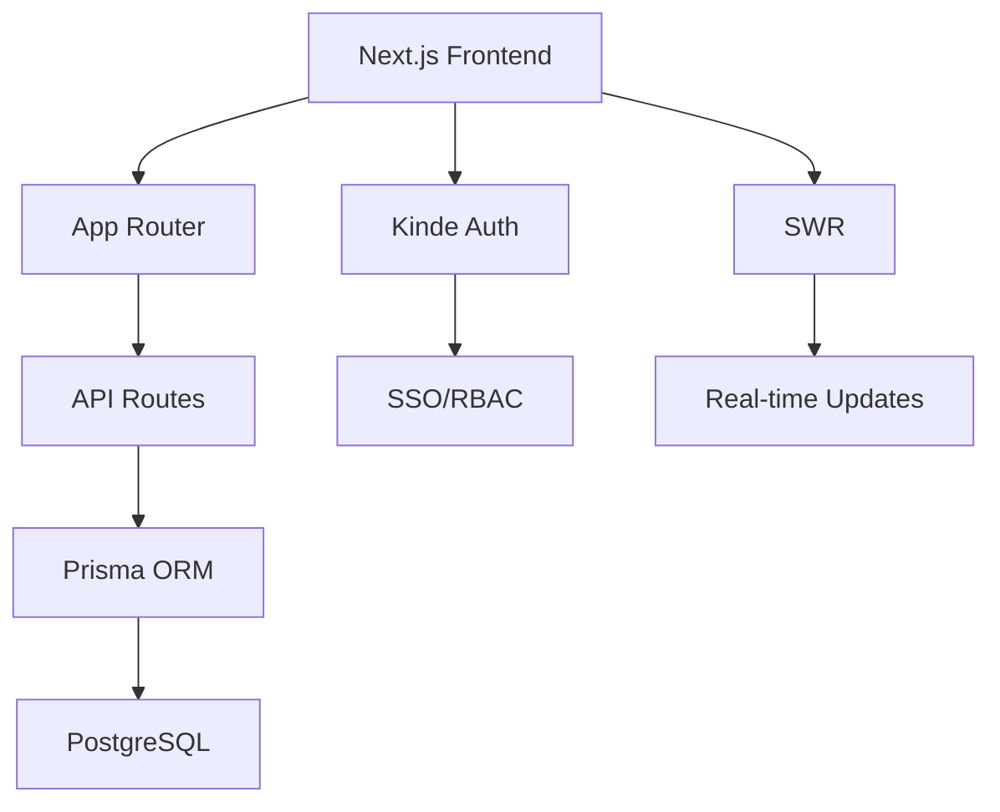

<div align="center">
  <h1 style="margin: 2rem 0; font-size: 3rem; background: linear-gradient(45deg, #0070f3, #00c7ff); -webkit-background-clip: text; -webkit-text-fill-color: transparent;">
    🚀 Next.js Todo Enterprise
  </h1>
  
  <div style="display: flex; gap: 1rem; justify-content: center; margin-bottom: 3rem">
    
    
    
  </div>
</div>

---

## 🎯 Core Features

<div style="display: grid; grid-template-columns: repeat(auto-fit, minmax(300px, 1fr)); gap: 1.5rem; margin: 3rem 0">
  <div style="padding: 2rem; background: #1a1a1a; border-radius: 16px; border: 1px solid #2a2a2a">
    <div style="display: flex; align-items: center; gap: 1rem; margin-bottom: 1rem">
      
      <h3 style="margin: 0">Enterprise Auth</h3>
    </div>
    <p>Secure authentication with Kinde including SSO, RBAC, and audit logs</p>
  </div>
  
  <div style="padding: 2rem; background: #1a1a1a; border-radius: 16px; border: 1px solid #2a2a2a">
    <div style="display: flex; align-items: center; gap: 1rem; margin-bottom: 1rem">
      
      <h3 style="margin: 0">Real-time Sync</h3>
    </div>
    <p>Instant cross-device synchronization using SWR's stale-while-revalidate</p>
  </div>
</div>

---

## 🛠️ Installation Guide

### Requirements
- Node.js v18+
- PostgreSQL v15+
- Kinde Account

```bash
# Clone repository (SSH)
git clone git@github.com:Nuu-maan/todo-webapp.git

# Install dependencies
npm install

# Configure environment
cp .env.example .env.local

# Database setup
npx prisma migrate dev --name init

# Start development server
npm run dev
```

---

## 📈 System Architecture



---

## 🌍 Live Demo

<div align="center" style="margin: 3rem 0">
  <a href="https://todo-webapp-demo.vercel.app">
    
  </a>
</div>

---

## 🤝 Contributors

<div style="display: grid; grid-template-columns: repeat(auto-fit, minmax(200px, 1fr)); gap: 2rem; margin: 3rem 0">
  <div style="text-align: center">
    <a href="https://github.com/Nuu-maan">
      
      <h3>Numan</h3>
      <p>Core Architect</p>
    </a>
  </div>
  
  <div style="text-align: center">
    <a href="https://github.com/anisvsc">
      
      <h3>Anish Gupta</h3>
      <p>Fullstack Developer</p>
    </a>
  </div>
</div>

---

## 📜 License

This project is licensed under the **MIT License** - see the [LICENSE](LICENSE) file for details.

<div align="center" style="margin-top: 4rem; padding: 2rem; background: linear-gradient(45deg, #1a1a1a, #2a2a2a); border-radius: 16px">
  <h3>Support the Project</h3>
  <a href="https://github.com/Nuu-maan/todo-webapp">
    
  </a>
</div>
