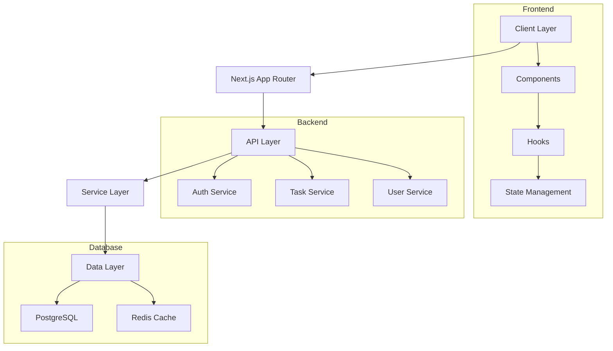

# 🚀 Next.js Todo Enterprise

[](https://github.com/Nuu-maan/todo-webapp/stargazers)
[](https://github.com/Nuu-maan/todo-webapp)
[](LICENSE)
[](https://www.typescriptlang.org/)
[](https://nextjs.org/)

[Demo](https://todo-webapp-demo.vercel.app) • [Documentation](#documentation) • [Installation](#-installation) • [Contributing](#-contributing)


## ✨ Features

### 🔐 Enterprise Authentication
- Single Sign-On (SSO) Integration
- Role-Based Access Control (RBAC)
- Comprehensive Audit Logging
- Multi-factor Authentication
- Session Management

### 🔄 Real-time Collaboration
- Live Updates with SWR
- Conflict Resolution
- Offline Support
- Data Synchronization
- Real-time Notifications

### 📊 Advanced Analytics
- User Activity Tracking
- Performance Metrics
- Custom Dashboards
- Export Capabilities
- Trend Analysis

### 🛡️ Enterprise Security
- End-to-End Encryption
- Data Backup & Recovery
- Compliance Management
- IP Whitelisting
- Security Audits

## 🚀 Quick Start

```bash
# Clone the repository
git clone https://github.com/Nuu-maan/todo-webapp.git

# Navigate to project directory
cd todo-webapp

# Install dependencies
npm install

# Setup environment variables
cp .env.example .env.local

# Run database migrations
npx prisma migrate dev

# Start development server
npm run dev
```

## 🏗️ System Architecture



## 📊 Performance Metrics

```javascript
// Performance metrics visualization will be rendered here using React and Recharts
```

## 🛠️ Tech Stack

### Frontend
- Next.js 14+
- TypeScript
- Tailwind CSS
- SWR
- Framer Motion

### Backend
- Node.js
- PostgreSQL
- Prisma ORM
- Redis
- GraphQL

### DevOps
- Docker
- GitHub Actions
- Vercel
- Jest
- Cypress

### Security
- Kinde Auth
- JWT
- HTTPS
- Rate Limiting
- Content Security Policy

## 👥 Contributors


**Numan** - *Frontend Lead*  
[GitHub](https://github.com/Nuu-maan)


**Anish Gupta** - *Backend Lead*  
[GitHub](https://github.com/anisvsc)

## 📄 License

This project is licensed under the MIT License - see the [LICENSE](LICENSE) file for details.

---

### ⭐ Support the Project

[](https://github.com/Nuu-maan/todo-webapp/stargazers)
[](https://github.com/Nuu-maan)

Made with ❤️ by the Next.js Todo Enterprise Team