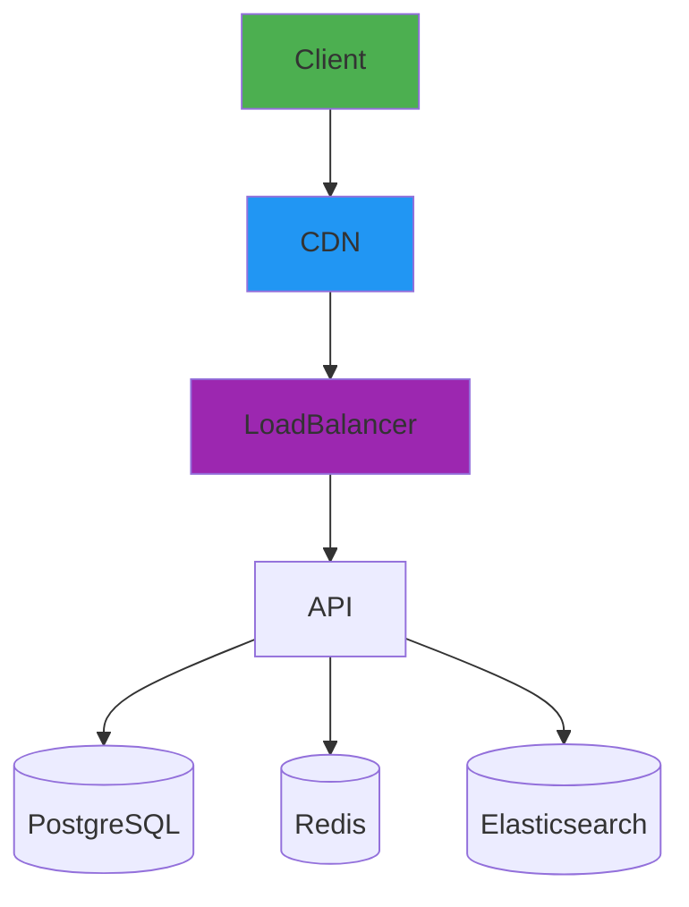
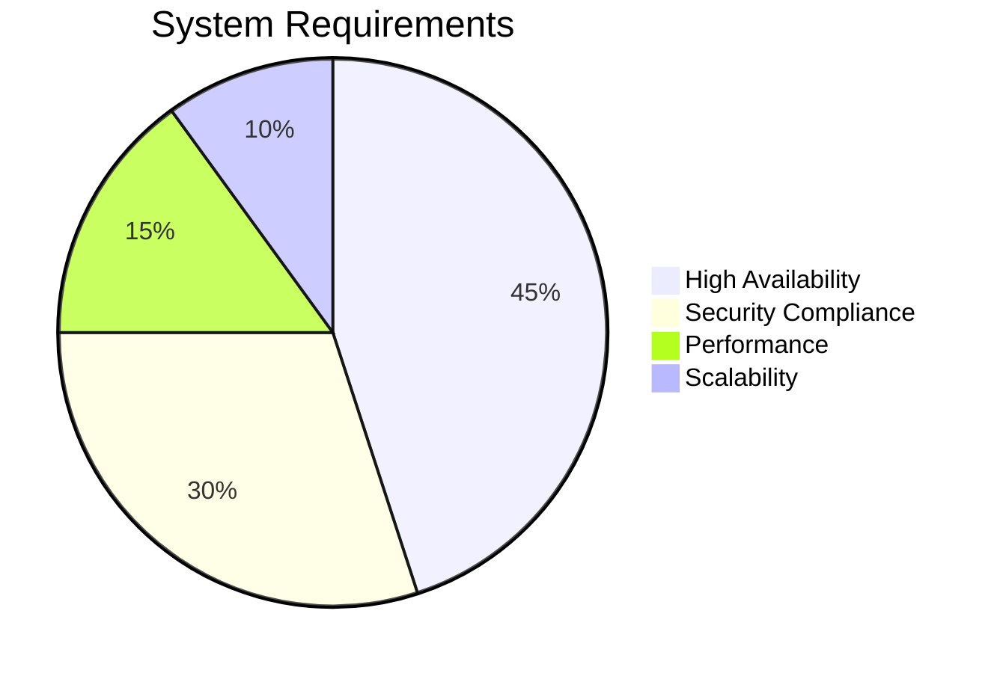

<div align="center">

<h1>🚀 Next.js Todo Enterprise</h1>

[](https://github.com/Nuu-maan/todo-webapp/stargazers)
[](LICENSE)
[](https://nextjs.org/)

[Live Demo](https://todo-webapp-demo.vercel.app) | [Documentation](/docs) | [Enterprise Support](mailto:support@todo-enterprise.com)


</div>

## 🌟 Key Features

### Enterprise Capabilities
<div align="center">

| Security & Compliance | Collaboration & Productivity | Administration & Control |
|-----------------------|------------------------------|--------------------------|
| 🔐 SAML/SSO Integration | 👥 Real-time Team Workspaces | 🏢 Organizational Hierarchy |
| 🛡️ GDPR/HIPAA Ready | 💬 Comments & Mentions | 📊 Usage Analytics Dashboard |
| 🔑 RBAC & Permissions | 📅 Shared Calendars | 🔄 Bulk Operations |
| 📝 Audit Logging | 🚀 Task Automation | 📜 Policy Management |

</div>

## 🏛️ Architecture Overview



## 🚦 Getting Started

### Prerequisites
- Node.js 18.x
- PostgreSQL 15+
- Redis 7+

### Installation

```bash
# Clone repository
git clone https://github.com/Nuu-maan/todo-webapp.git

# Install dependencies
npm install

# Configure environment
cp .env.example .env.local

# Database setup
npx prisma migrate deploy

# Start development server
npm run dev
```

## 🧩 Core Technologies

**Frontend**
- Next.js 14 (App Router)
- TypeScript 5.3
- Tailwind CSS 3.4
- React Aria Components

**Backend**
- Next.js API Routes
- Prisma ORM 5.7
- Zod Validation 3.22
- Redis OM 0.4

**Infrastructure**
- Docker 24.0
- Kubernetes 1.28
- Prometheus 2.47
- Grafana 10.1

## 📈 Enterprise Metrics



## 📄 License

This project is licensed under the **MIT License** - see [LICENSE](LICENSE) for details.  
Enterprise edition includes additional proprietary modules under commercial license.
</div>
