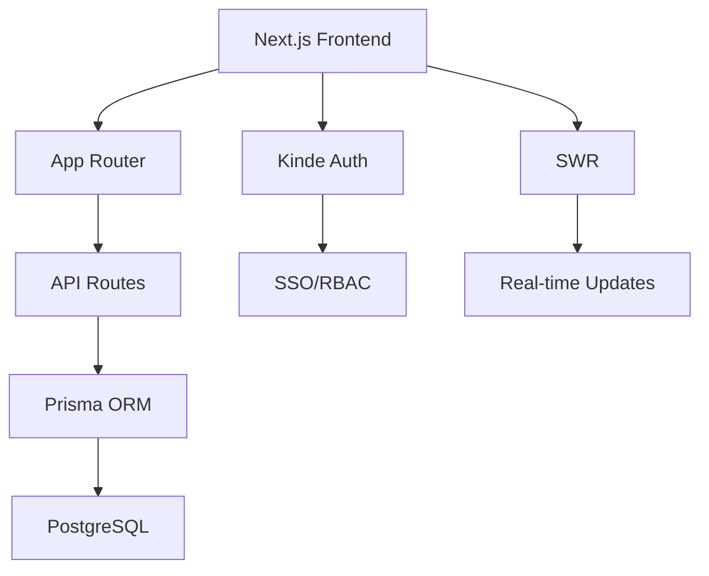

<div align="center">
  <h1 style="margin: 2rem 0; font-size: 3rem; background: linear-gradient(45deg, #0070f3, #00c7ff); -webkit-background-clip: text; -webkit-text-fill-color: transparent;">
    🚀 Next.js Todo Enterprise
  </h1>
  
  <div style="display: flex; gap: 1rem; justify-content: center; margin-bottom: 3rem">
    
    
    
  </div>
</div>

---

## 🛠 Core Features

<div style="display: grid; grid-template-columns: repeat(auto-fit, minmax(300px, 1fr)); gap: 1.5rem; margin: 3rem 0">
  <!-- Auth Card -->
  <div style="padding: 2rem; background: #f8f9fa; border-radius: 16px; border-left: 4px solid #6366f1">
    <div style="display: flex; align-items: center; gap: 1rem; margin-bottom: 1rem">
      <div>
        <h3 style="margin: 0">Enterprise Auth</h3>
        <div style="display: flex; gap: 0.5rem; margin-top: 0.5rem">
          
        </div>
      </div>
    </div>
    <p>Secure authentication with SSO, RBAC, and audit logs</p>
  </div>

  <!-- Sync Card -->
  <div style="padding: 2rem; background: #f8f9fa; border-radius: 16px; border-left: 4px solid #f472b6">
    <div style="display: flex; align-items: center; gap: 1rem; margin-bottom: 1rem">
      <div>
        <h3 style="margin: 0">Real-time Sync</h3>
        <div style="display: flex; gap: 0.5rem; margin-top: 0.5rem">
          
        </div>
      </div>
    </div>
    <p>Instant synchronization using stale-while-revalidate pattern</p>
  </div>
</div>
---

## 🛠️ Installation Guide

### Requirements
- Node.js v18+
- PostgreSQL v15+
- Kinde Account

```bash
# Clone repository (SSH)
git clone git@github.com:Nuu-maan/todo-webapp.git

# Install dependencies
npm install

# Configure environment
cp .env.example .env.local

# Database setup
npx prisma migrate dev --name init

# Start development server
npm run dev
```

---

## 📈 System Architecture



---

## 🌍 Live Demo

<div align="center" style="margin: 3rem 0">
  <a href="https://todo-webapp-demo.vercel.app">
    
  </a>
</div>

---

## 🤝 Contributors

<div style="display: grid; grid-template-columns: repeat(auto-fit, minmax(250px, 1fr)); gap: 2rem; margin: 3rem 0">
  <div style="text-align: center; padding: 1.5rem; background: #f8f9fa; border-radius: 12px; transition: transform 0.2s">
    <div style="margin: 0 auto; width: 120px; height: 120px; border-radius: 50%; overflow: hidden; border: 3px solid #0070f3">
      
    </div>
    <h3 style="margin: 1rem 0">Numan</h3>
    <div style="display: flex; gap: 1rem; justify-content: center">
      <a href="https://github.com/Nuu-maan">
        
      </a>
    </div>
  </div>

  <div style="text-align: center; padding: 1.5rem; background: #f8f9fa; border-radius: 12px; transition: transform 0.2s">
    <div style="margin: 0 auto; width: 120px; height: 120px; border-radius: 50%; overflow: hidden; border: 3px solid #00c7ff">
      
    </div>
    <h3 style="margin: 1rem 0">Anish Gupta</h3>
    <div style="display: flex; gap: 1rem; justify-content: center">
      <a href="https://github.com/anisvsc">
        
      </a>
    </div>
  </div>
</div>

---

## 📜 License

This project is licensed under the **MIT License** - see the [LICENSE](LICENSE) file for details.

<div align="center" style="margin-top: 4rem; padding: 2rem; background: linear-gradient(45deg, #1a1a1a, #2a2a2a); border-radius: 16px">
  <h3>Support the Project</h3>
  <a href="https://github.com/Nuu-maan/todo-webapp">
    
  </a>
</div>
