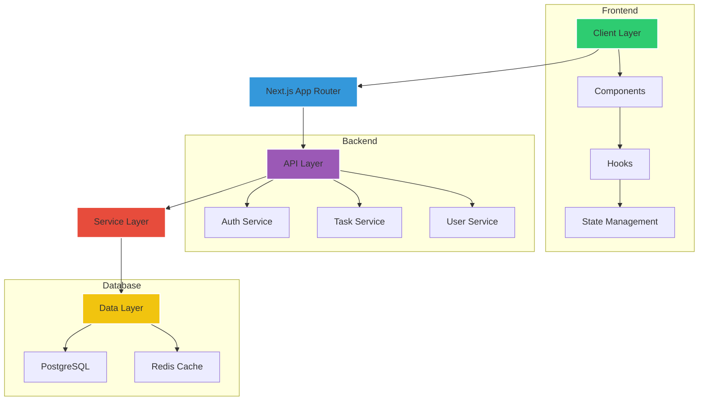

<div align="center">

# 🚀 Next.js Todo Pro

[](https://github.com/Nuu-maan/todo-webapp/stargazers)
[](LICENSE)
[](https://nextjs.org/)


</div>

## ✨ Features

<div align="center">

| Core Functionality | Collaboration | Security |
|--------------------|---------------|----------|
| ✅ Task Management | 👥 Shared Workspaces | 🔐 OAuth 2.0 |
| 📅 Due Dates | 💬 Comments | 🔑 RBAC |
| 🏷️ Labels & Filters | 📊 Activity Feed | 🔒 Encryption |
| 🔄 Sync Across Devices | 📁 File Attachments | 📝 Audit Logs |

</div>

## 🏗 Architecture



## 🛠️ Tech Stack

**Frontend**
- **Framework**: Next.js 14 (App Router)
- **Language**: TypeScript 5.3
- **Styling**: Tailwind CSS + CSS Modules
- **State**: Zustand
- **Components**: Shadcn UI

**Backend**
- **Runtime**: Node.js 18 LTS
- **ORM**: Prisma
- **Database**: PostgreSQL
- **Cache**: Redis
- **Validation**: Zod

## 🚀 Quick Start

```bash
# Clone repository
git clone https://github.com/Nuu-maan/todo-webapp.git

# Install dependencies
pnpm install

# Configure environment
cp .env.example .env.local

# Run database migrations
pnpm db:push

# Start development server
pnpm dev
```

## 📄 License

MIT License © 2024 [Numan](https://github.com/Nuu-maan)  
See [LICENSE](LICENSE) for full text.

---

<div align="center">

**Need Help?**  
[Open an Issue](https://github.com/Nuu-maan/todo-webapp/issues)  
[View Documentation](/docs)

</div>

