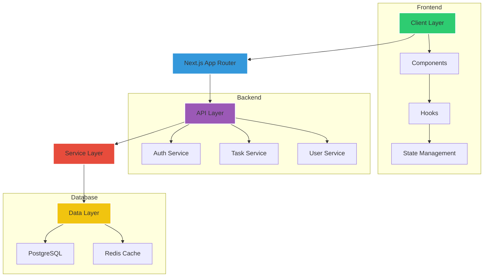

<div align="center">

# 🚀 Next.js Todo Pro

[](https://github.com/Nuu-maan/todo-webapp/stargazers)
[](https://github.com/Nuu-maan/todo-webapp/issues)
[](LICENSE)


</div>

## 🌟 Key Features

<div align="center">

| 🛠 Core Functionality    | 🌐 Collaboration       | 🔒 Security         |
|-------------------------|-----------------------|--------------------|
| 📝 Rich Text Tasks      | 👥 Shared Workspaces  | 🔐 OAuth 2.0       |
| 🗓 Smart Due Dates       | 💬 Threaded Comments  | 🔑 RBAC            |
| 🏷 Custom Labels         | 📊 Activity Analytics | 🔒 E2E Encryption  |

</div>

## 🧑💻 Core Team

<div align="center">

<table>
  <tr>
    <td align="center">
      <a href="https://github.com/Nuu-maan">
        
        <br/>
        <strong>Numan</strong>
      </a>
      <br/>
      <a href="https://github.com/Nuu-maan?tab=followers">
        
      </a>
    </td>
    <td align="center">
      <a href="https://github.com/anisvsc">
        
        <br/>
        <strong>Anish Gupta</strong>
      </a>
      <br/>
      <a href="https://github.com/anisvsc?tab=followers">
        
      </a>
    </td>
  </tr>
</table>

</div>

## 🏗 Architecture Overview



## 🛠 Technology Stack

<div align="center">

| Layer       | Technologies                                                                                  |
|-------------|-----------------------------------------------------------------------------------------------|
| **Frontend**| Next.js 14, TypeScript 5, Tailwind CSS, React Aria, Zustand                                    |
| **Backend** | Node.js 18, Prisma, PostgreSQL, Redis,                                                     |
| **DevOps**  | Docker, GitHub Actions, Vercel, ,                                            |
| **Tools**   | ESLint, Prettier, Husky, Commitlint                                                       |

</div>

## 🚀 Getting Started

```bash
# Clone repository
git clone https://github.com/Nuu-maan/todo-webapp.git

# Install dependencies
npm install

# Configure environment
cp .env.example .env.local

# Run migrations
npx prisma migrate dev

# Start development server
npm run dev
```

## 📜 License 

[](https://opensource.org/licenses/MIT)

This project is licensed under the MIT License - see the [LICENSE](LICENSE) file for full text.

---

<div align="center">

[](https://github.com/Nuu-maan/todo-webapp/graphs/contributors)
[](https://github.com/Nuu-maan/todo-webapp/commits/main)

</div>


**Copyright © 2024 Numan & Anish Gupta** - [View License](LICENSE)